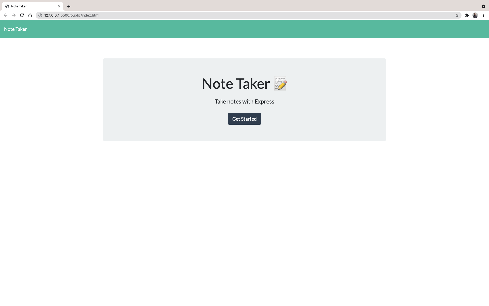
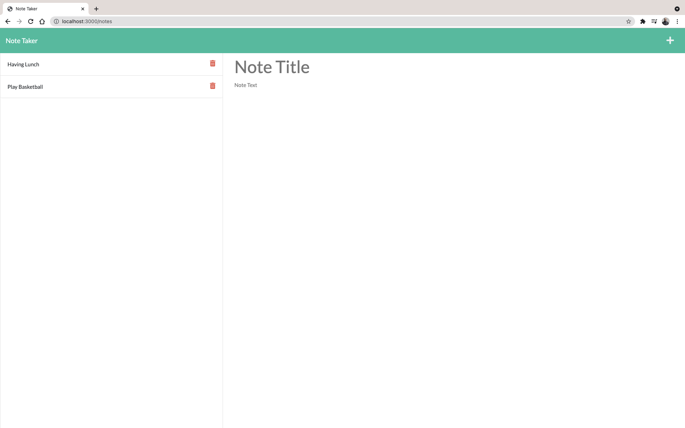

<div id="top"></div>

<!-- Badges -->
[](http://shields.io/)
[](http://shields.io/)
[](http://shields.io/)
[](http://shields.io/)
[](http://shields.io/)
[](http://shields.io/)
[](http://shields.io/)
[](http://shields.io/)
[](http://shields.io/)

# Note Taker
This application called Note Taker that can be used to write and save notes.This application  use's an Express.js back end and will save and retrieve note data from a JSON file.

## Table of Contents
<!-- TABLE OF CONTENTS -->
<details>
  <summary><strong>Table of Contents</strong></summary>
  <ol>
    <li>
      <a href="#about-the-project">About The Project</a>
      <ul>
        <li><a href="#built-with">Built With</a></li>
      </ul>
    </li>
    <li><a href="#user-story">User Story</a></li>
    <li><a href="#link-to-live-demo">Link to Live Demo</a></li>
    <li><a href="#usage">Usage</a></li>
    <li><a href="#prerequisites">Prerequisites</a></li>
    <li><a href="#installation">Installation</a></li>
    <li><a href="#contributing">Contributing</a></li>
    <li><a href="#license">License</a></li>
    <li><a href="#contact">Contact</a></li>
    <li><a href="#acknowledgments">Acknowledgments</a></li>
  </ol>
</details>

## About The Project
- For users that need to keep track of a lot of information, it's easy to forget or be unable to recall something important.
- Being able to take persistent notes allows users to have written information available when needed.
- The application also have a `db.json` file on the back end that will be used to store and retrieve notes using the `fs` module.
<p align="center">
   
&nbsp; &nbsp; &nbsp; &nbsp;
  
</p>

## User Story

```md
AS A small business owner
I WANT to be able to write and save notes
SO THAT I can organize my thoughts and keep track of tasks I need to complete
```

### Link to Live Demo
[note-taker4](https://note-taker4.herokuapp.com/)

### Prerequisites

Please make sure that you have the latest node packages.
* npm
  ```sh
  npm install npm@latest -g
  ```

## Installation 
- Download it through Github
- Run npm i or (npm install), to make sure to download the jason package, inquirer, Express and nodemon.
- The reason for using 'nodemon' is to make sure that you don't have to keep restarting your server.

## Usage 
After installation run command `node server.js` in the command line to start running the app.

### Built With

JavaScript, NodeJS, and Express.
<p align="right">(<a href="#top">back to top</a>)</p>

## Contributing

Contributions are what make the open source community such an amazing place to learn, inspire, and create. Any contributions you make are **greatly appreciated**.

If you have a suggestion that would make this better, please fork the repo and create a pull request. You can also simply open an issue with the tag "enhancement".
Don't forget to give the project a star! Thanks again!

1. Fork the Project
2. Create your Feature Branch (`git checkout -b feature/AmazingFeature`)
3. Commit your Changes (`git commit -m 'Add some AmazingFeature'`)
4. Push to the Branch (`git push origin feature/AmazingFeature`)
5. Open a Pull Request


<!-- CONTACT -->
## Contact
[](http://shields.io/)

Mohamed Mesahel - mohamed.mesahel86@gmail.com

[](http://shields.io/)

https://github.com/MohamedMesahel

[![LinkedIn][linkedin-shield]][linkedin-url] 

<!-- LICENSE -->
## License

Distributed under the MIT License. 
<!-- ACKNOWLEDGMENTS -->
## Acknowledgments

List for some useful resources!
* [Express](https://expressjs.com/)
* [HEROKU](https://www.heroku.com/)


<p align="right">(<a href="#top">back to top</a>)</p>

<!-- MARKDOWN LINKS & IMAGES -->
<!-- https://www.markdownguide.org/basic-syntax/#reference-style-links -->
[linkedin-shield]: https://img.shields.io/badge/LinkedIn-0077B5?style=for-the-badge&logo=linkedin&logoColor=white
[linkedin-url]: https://www.linkedin.com/in/mohamed-mesahel-pmp-570a0423/


